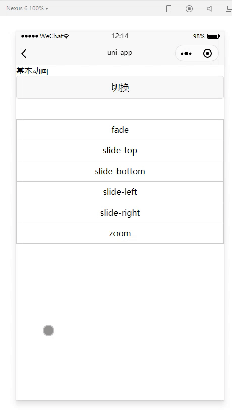
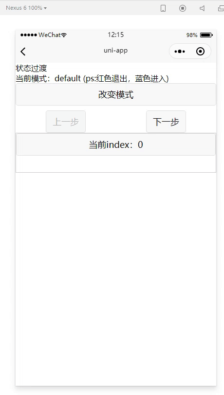
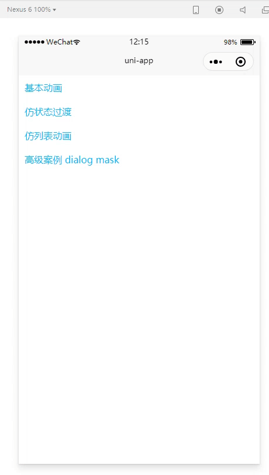
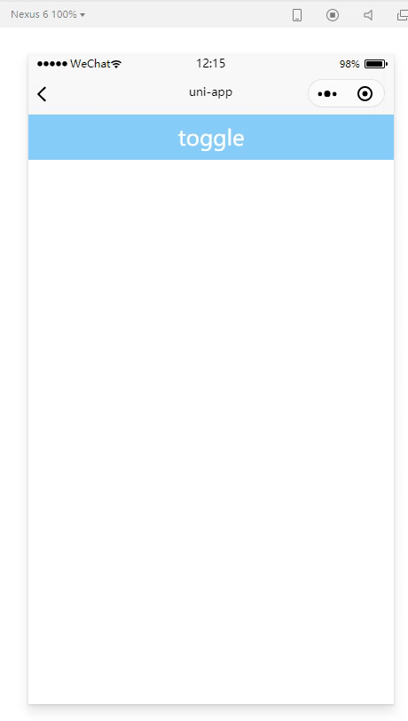

# my-transition,仿transition的跨平台实现

> 仿照vue原生transition用法的跨平台uni-app transition组件，用法transition相似

## 原理
- 实现原理非常简单，由于小程序端无法直接操作dom，就自己添加一层包装
- 用数据直接来驱动视图，在修改value属性的时候动态添加class样式就可以了
- 只需要在修改value的前后添加几个class就可以
- 在hide->show的时候，需要提前把value设置成true，然后延迟20毫秒，强制刷新才有开始动画
- 小程序由于setTimeout 20 执行远大于预期，使用阻塞微任务队列的方式替代

## 特别说明1 不要使用css animation动画
- 由于小程序平台受限如果在`v-enter-active` `v-leave-active`使用`animation`动画会造成小程序定时器预计时间远大于预期，表现的效果就是动画结束比较卡
- 所有最好不要使用 `animation`，如果要实现animation动画，请在对应事件`before-xxx`使用 `uni.createAnimation`创建动画，然后通过`my-transition`做包装帮你执行`v-show` `v-if`

## 特别说明2 注意写css transition的位置
- 由于小程序平台受限，如果是在**自定义组件里面编写的 css transition 动画将无效**
- 强烈建议把css transition动画<span style="font-size:2em">`App.vue`</span>或者在`pages.json`注册的<span style="font-size:2em">页面组件</span>中，否则动画将无效

## api
- api使用和vue transition 基本一致，支持事件也是一样，支持`appear` `enter` `leave` 的 before、after、cancel事件
- 属性中的duration为非必填项，建议和css中的 transition 保持一致，默认为`300毫秒`

| 属性名        | 类型    | 默认值 | 说明                                                                                                                                                                                               |
| ------------- | ------- | ------ | -------------------------------------------------------------------------------------------------------------------------------------------------------------------------------------------------- |
| value         | Boolean | -      | 必填，表示该组件是否显示用来控制退出和结束动画的关键属性                                                                                                                                           |  |
| name          | String  | -      | 必填，和`transition`的name属性一致，表示动画执行的前缀                                                                                                                                             |
| duration      | number  | 300ms  | 表示动画执行的时间，单位毫秒，注意和css中transition的时间保持一致，<b>这个duration不会强制去设置`transition-duration`和`animation-duration`</b>，如果需要强制设置动画时间，请参考`customStyle`属性 |
| appear        | Boolean | false  | 和`transition`组件的appear属性保持一致，在初始化渲染组件的时候如果 value为true，那么就会执行enter动画                                                                                              |
| destroyOnHide | Boolean | false  | 内部是否使用 v-if 替代 v-show 来隐藏dom，如果是内部元素内容比较大，建议开启                                                                                                                        |
| customClass   | String  | -      | 给外包装层view添加自定义class类名                                                                                                                                                                  |
| customStyle   | Object  | -      | 给外包装层view添加自定义style行内样式                                                                                                                                                              |


## 提供几种常见的场景demo
- 基本动画
  - 基本的css transition 动画
  - 
- 仿状态过渡
  - 仿照vue transition 的mode属性，模拟了 in-out 和 out-in 
  - 
- 仿列表动画
  - 仿照列表的删除和新增动画
  - 
- 高级案例dialog-mask
  - 综合案例，实现一个简单的dialog模态框和mask
  - 
  
## 基本demo源码

````vue
<template>
  <view class="baseTransition">
    <view>基本动画</view>
    <view style="display: flex;align-items: center">
    </view>
    <button @click="show = !show">切换</button>
    <view style="height: 40px;" />
    <view>
      <view
        v-for="item in list"
        :key="item"
        class="item"
      >
        <my-transition
          :value="show"
          :name="item"
          :duration="duration"
        >{{ item }}
        </my-transition>
      </view>
    </view>
  </view>
</template>

<script>
import MyTransition from 'components/arm-liang-transition/arm-liang-transition'

export default {
  name: 'BaseTransition',
  components: { MyTransition },
  data() {
    return {
      duration: 300,
      show: true,
      list: ['fade', 'slide-top', 'slide-bottom', 'slide-left', 'slide-right', 'zoom']
    }
  }
}
</script>

<style lang="scss">
  @import "uni";

  .item {
    text-align: center;
    height: 40px;
    line-height: 40px;
    border: solid 1px #ccc;
    margin-bottom: -1px;
  }
  @mixin anim($animName) {
    @at-root {
      .#{$animName} {
        &-enter,
        &-leave-to {
          @content;
        }

        &-enter-active,
        &-leave-active {
          transition: all .3s;
        }
      }
    }
  }


  page {
    @include anim(fade) {
      opacity: 0;
    }

    @include anim(slide-top) {
      opacity: 0;
      transform: translateY(-21px);
    }

    @include anim(slide-bottom) {
      opacity: 0;
      transform: translateY(19px);
    }

    @include anim(slide-right) {
      opacity: 0;
      transform: translateX(19px);
    }

    @include anim(slide-left) {
      opacity: 0;
      transform: translateX(-21px);
    }

    @include anim(zoom) {
      opacity: .3;
      transform: scale(.5);
    }
  }

</style>

````
